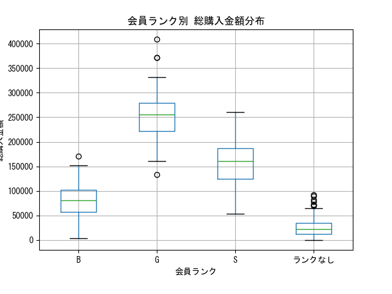

# 会員ランクと購買行動の関係分析

## プロジェクト概要
本プロジェクトでは、ECサイトの会員ランク制度が購買行動にどの程度影響を与えているかを検証した。
顧客単位で購買データを集計し、ランク別の購買傾向を分析・可視化することで、制度の有効性を評価した。

## 1. 背景
ECサイトにおける会員ランク制度が購買行動に与える影響を検証する。

## 2. 分析目的
会員ランクと総購入金額・購入回数の関係を明らかにする。

## 3. 分析方法
SQLで顧客単位に集計し、Pythonで可視化を実施した。

## 4. 分析結果
ランク別集計の結果、会員ランクが上昇するにつれて平均購入回数および平均総購入金額が段階的に増加していることが確認できた。

箱ひげ図からも、総購入金額の中央値が  
G > S > B > ランクなし  
の順で明確に上昇しており、会員ランクと購買金額の間に強い相関が示唆される。

また、Gランクでは分布のばらつきが大きく、高額購入者が複数存在していることが確認できた。
一方でランクなし顧客は低水準に集中しているが、一部に高額購入者も存在している。

## 分析結果イメージ

## 5. 考察
本分析より、会員ランクは購買行動を一定程度反映しており、制度として機能していると考えられる。

特に上位ランク顧客は購買回数・購買金額ともに高く、VIP顧客層として重要なセグメントである。
一方で、ランクなし顧客の中にも高額購入者が存在することから、適切なアプローチにより上位ランクへの育成が期待できる。

## 6. 改善提案
分析結果を踏まえ、以下の施策が有効と考えられる。

・ランクなし顧客のうち高額購入者に対するランク付与条件の明示  
・ランクアップを促すキャンペーン施策の実施  
・全顧客への継続利用を促進する特典強化  

これにより、顧客単価の向上およびLTV最大化が期待できる。

## ディレクトリ構成

ec-data-analysis-portfolio/
├── data/        # データ保存用（今回は未使用）
├── notebooks/   # 分析過程のNotebook
├── sql/
├── src/
├── output/
└── README.md

## 使用技術

・SQL  
・Python（pandas, matplotlib）  
・Jupyter Notebook  

## 実行方法

1. DB接続設定（db_connect.py）を準備  
2. src/membership_analysis.py を実行  
3. outputフォルダに集計結果とグラフが出力される  

---
